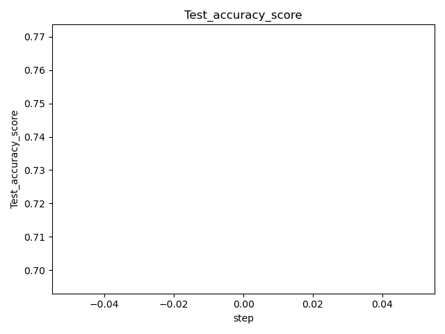
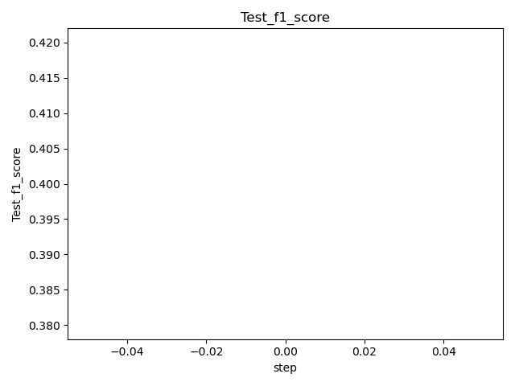
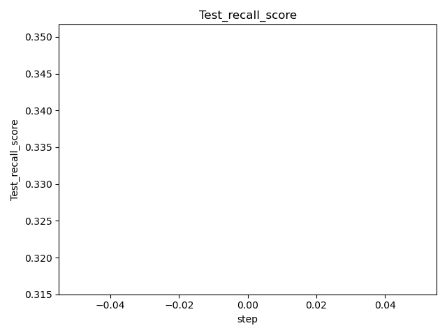
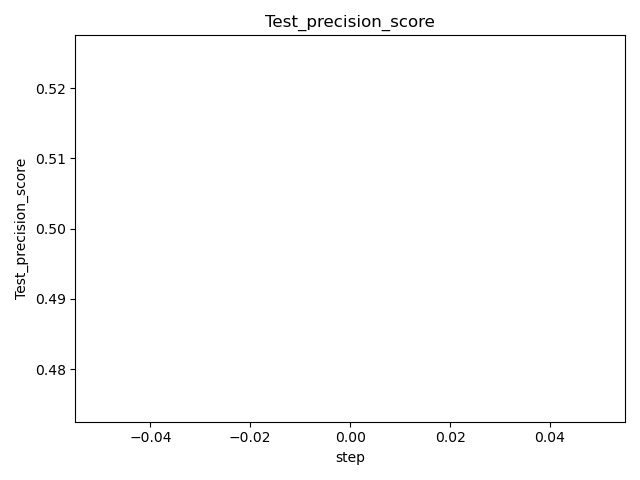
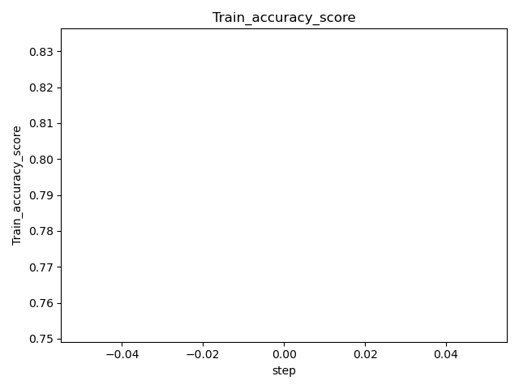
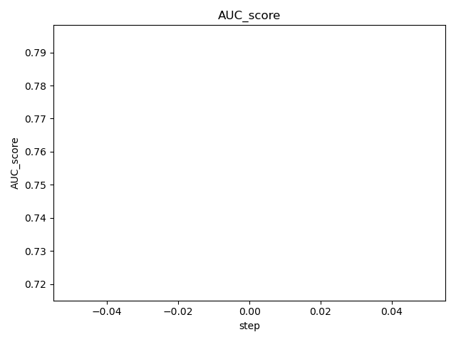

# DVC Report

params.yaml

|   C | class_weight   | dual   | fit_intercept   |   intercept_scaling | l1_ratio   |   max_iter | multi_class   | n_jobs   | penalty   | random_state   | solver   |    tol |   verbose | warm_start   |
|-----|----------------|--------|-----------------|---------------------|------------|------------|---------------|----------|-----------|----------------|----------|--------|-----------|--------------|
|   1 |                | False  | True            |                   1 |            |        100 | auto          |          | l2        |                | lbfgs    | 0.0001 |         0 | False        |

metrics.json

|   Train_accuracy_score |   Test_accuracy_score |   Test_precision_score |   Test_recall_score |   Test_f1_score |   AUC_score |
|------------------------|-----------------------|------------------------|---------------------|-----------------|-------------|
|               0.792717 |              0.733333 |                    0.5 |            0.333333 |             0.4 |    0.756629 |

